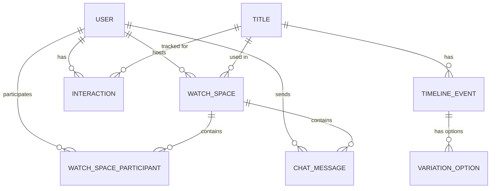

# 🎬 Netflix AI Watch Spaces — Complete Project Audit Report

> **Generated**: 2026-09-28 | **Mode**: Read-only audit — zero files modified

---

## A. Complete Project Structure

```
Netflix/
├── .env                                # Live Neon PostgreSQL creds, JWT secret, port config
├── .env.example                        # Template env (localhost defaults)
├── .gitignore                          # Standard Java/Node/IDE ignores
├── docker-compose.yml                  # Local Postgres 15 + pgAdmin (not used in prod)
├── GEMINI.md                           # Workspace rules: Nocturne Luminary design system
├── download_screens.cjs                # Stitch screen download utility
├── download_screens_v2.cjs             # Stitch screen download utility v2
├── frontend.zip                        # Archived frontend build (~24 MB)
│
├── Documents/                          # 15 markdown/doc files
│   ├── ARCHITECTURE.md
│   ├── API.md
│   ├── DATABASE.md
│   ├── REQUIREMENTS.md
│   ├── IMPLEMENTATION_PLAN.md
│   ├── RECOMMENDATIONS.md
│   ├── AI_ENGINE.md
│   ├── WEBSOCKET.md
│   ├── TESTING.md
│   ├── TIMELINE_SCHEMA.md
│   ├── STITCH_DESIGN_SYSTEM.md
│   ├── README.md
│   ├── done.md                         # Completed deliverables tracker
│   ├── to-do.md                        # Future roadmap
│   └── Netflix document.docx           # Original project brief
│
├── stitch_screens_nocturne/            # 7 Stitch HTML design reference screens
│   ├── landing_page.html
│   ├── sign_in.html
│   ├── get_started.html
│   ├── home_nocturne.html
│   ├── discover_nocturne.html
│   ├── my_spaces_nocturne.html
│   └── live_theater_nocturne.html
│
├── backend/                            # Spring Boot 2.7.18 (Java 11, Maven)
│   ├── pom.xml
│   └── src/
│       ├── main/
│       │   ├── java/com/netflix/ai/watchspaces/
│       │   │   ├── WatchSpacesApplication.java          # Entry point
│       │   │   ├── config/
│       │   │   │   ├── SecurityConfig.java              # CORS, JWT filter, route auth
│       │   │   │   └── WebSocketConfig.java             # WS handler registration
│       │   │   ├── controller/                          # 6 controllers
│       │   │   │   ├── AuthController.java
│       │   │   │   ├── WatchSpaceController.java
│       │   │   │   ├── TitleController.java
│       │   │   │   ├── AiController.java
│       │   │   │   ├── RecommendationController.java
│       │   │   │   ├── AdminTimelineController.java
│       │   │   │   └── GlobalExceptionHandler.java
│       │   │   ├── dto/                                 # 7 DTO files
│       │   │   │   ├── AuthDtos.java
│       │   │   │   ├── WatchSpaceDtos.java
│       │   │   │   ├── TitleDtos.java
│       │   │   │   ├── AiDtos.java
│       │   │   │   ├── RecommendationDtos.java
│       │   │   │   ├── WsDtos.java
│       │   │   │   └── ErrorResponse.java
│       │   │   ├── entity/                              # 8 JPA entities
│       │   │   │   ├── User.java
│       │   │   │   ├── UserRole.java
│       │   │   │   ├── Title.java
│       │   │   │   ├── TimelineEvent.java
│       │   │   │   ├── VariationOption.java
│       │   │   │   ├── WatchSpace.java
│       │   │   │   ├── WatchSpaceParticipant.java
│       │   │   │   ├── WatchSpaceParticipantId.java
│       │   │   │   ├── WatchSpaceStatus.java
│       │   │   │   ├── ChatMessage.java
│       │   │   │   └── Interaction.java
│       │   │   ├── repository/                          # 8 JPA repositories
│       │   │   ├── security/                            # 5 security classes
│       │   │   │   ├── JwtTokenProvider.java
│       │   │   │   ├── JwtAuthenticationFilter.java
│       │   │   │   ├── UserPrincipal.java
│       │   │   │   ├── UserDetailsServiceImpl.java
│       │   │   │   └── RestAuthenticationEntryPoint.java
│       │   │   ├── service/                             # 7 services
│       │   │   │   ├── AuthService.java
│       │   │   │   ├── WatchSpaceService.java
│       │   │   │   ├── TitleService.java
│       │   │   │   ├── TimelineService.java
│       │   │   │   ├── AiCopilotService.java
│       │   │   │   ├── RecommendationService.java
│       │   │   │   └── DataSeeder.java
│       │   │   └── websocket/
│       │   │       ├── WatchSpaceWebSocketHandler.java
│       │   │       └── RoomSessionManager.java
│       │   └── resources/
│       │       └── application.yml
│       └── test/java/com/netflix/ai/watchspaces/       # 4 test files
│           ├── AuthServiceTest.java
│           ├── TimelineValidationTest.java
│           ├── RecommendationServiceTest.java
│           └── AiCopilotServiceTest.java
│
└── frontend/                           # React 18 + TypeScript + Vite
    ├── package.json
    ├── vite.config.ts                   # Proxy /api → :8081, /ws → :8081
    ├── tsconfig.json
    ├── index.html                       # Tailwind CDN, Geist font, Material Symbols, design tokens
    ├── public/
    │   └── hero-preview.jpg
    └── src/
        ├── main.tsx                     # React root
        ├── App.tsx                      # Router + state + fallback demo
        ├── index.css                    # CSS variables, glassmorphism, animations
        ├── types.ts                     # TypeScript interfaces
        ├── services/
        │   ├── api.ts                   # REST API client (all endpoints)
        │   └── websocket.ts            # WatchSpaceSocket class
        └── components/                  # 12 components
            ├── Navbar.tsx
            ├── LandingPage.tsx
            ├── SignInView.tsx
            ├── SignUpView.tsx
            ├── HomeCinema.tsx
            ├── Discover.tsx
            ├── MySpacesHub.tsx
            ├── WatchRoom.tsx
            ├── CreateRoomModal.tsx
            ├── JoinRoomModal.tsx
            ├── LoginModal.tsx
            └── AdminTimelineView.tsx
```

---

## B. Technology Stack

| Layer | Technology | Version |
|---|---|---|
| **Frontend Framework** | React + TypeScript | 18.2, TS 5.2 |
| **Build Tool** | Vite | 5.1.6 |
| **CSS Framework** | Tailwind CSS (CDN) | Latest via `cdn.tailwindcss.com` |
| **Icons** | Material Symbols Outlined | CDN |
| **Font** | Geist | Google Fonts CDN |
| **UI Library** | lucide-react | 0.344 (installed but **unused**) |
| **Backend Framework** | Spring Boot | 2.7.18 |
| **Language** | Java | 11 |
| **Build System** | Maven | via parent POM |
| **Database** | PostgreSQL (Neon Cloud) | 15 |
| **ORM** | Hibernate / Spring Data JPA | via Boot 2.7 |
| **Security** | Spring Security + JWT (jjwt 0.11.5) | — |
| **WebSocket** | Spring WebSocket (native) | — |
| **Reactive** | Spring WebFlux (dependency present, **barely used**) | — |
| **Validation** | javax.validation (Hibernate Validator) | — |
| **Dev DB** | Docker Compose (Postgres + pgAdmin) | Postgres 15-alpine |

---

## C. Frontend Architecture

### Routing
- **No router library** (no `react-router`). Navigation is implemented via a `useState<string>` called `activeTab` in [App.tsx](file:///d:/projects/Netflix/frontend/src/App.tsx).
- Values: `'landing'`, `'login'`, `'signup'`, `'home'`, `'discover'`, `'spaces'`, `'room'`, `'admin'`.
- All views are conditionally rendered in a single `<main>` block.

### State Management
- **No state library** (no Redux/Zustand/Context). All state is lifted to `App.tsx` using `useState` hooks.
- State: `currentUser`, `titles`, `activeSpaces`, `recommendations`, `history`, `activeSpace`, `activeTab`, modal booleans.
- Child components receive state via props.

### Component Map (7 pages + 5 modals/utilities)

| Component | Maps to Stitch Screen | Status |
|---|---|---|
| `LandingPage.tsx` | `landing_page.html` | ✅ Implemented |
| `SignInView.tsx` | `sign_in.html` | ✅ Implemented |
| `SignUpView.tsx` | `get_started.html` | ✅ Implemented |
| `HomeCinema.tsx` | `home_nocturne.html` | ✅ Implemented |
| `Discover.tsx` | `discover_nocturne.html` | ✅ Implemented |
| `MySpacesHub.tsx` | `my_spaces_nocturne.html` | ✅ Implemented |
| `WatchRoom.tsx` | `live_theater_nocturne.html` | ✅ Implemented |
| `Navbar.tsx` | (shared across all auth pages) | ✅ Implemented |
| `CreateRoomModal.tsx` | — | ✅ Implemented |
| `JoinRoomModal.tsx` | — | ✅ Implemented |
| `LoginModal.tsx` | — | ✅ Implemented (but rarely triggered) |
| `AdminTimelineView.tsx` | — | ✅ Implemented |

### Fallback / Offline Mode
- [App.tsx L97-198](file:///d:/projects/Netflix/frontend/src/App.tsx#L97-L198): `fallbackDemoState()` populates hardcoded demo titles, spaces, recommendations, and history when the backend is unreachable. This is a **safety net**, not a mock.

### API Integration Layer
- [api.ts](file:///d:/projects/Netflix/frontend/src/services/api.ts): Central fetch wrapper with JWT `Bearer` header injection, error parsing, and `localStorage` token management.
- [websocket.ts](file:///d:/projects/Netflix/frontend/src/services/websocket.ts): `WatchSpaceSocket` class: connect with token, subscribe/unsubscribe event patterns, drift measurement (ping/pong), playback sync, chat, voting, AI queries.

---

## D. Backend Architecture

### Layers
```
Controller → Service → Repository → Entity → PostgreSQL
                ↕
         WebSocket Handler → RoomSessionManager (in-memory)
```

### Controllers (6)
| Controller | Base Path | Auth | Endpoints |
|---|---|---|---|
| `AuthController` | `/api/v1/auth` | Public | register, login, refresh, me |
| `TitleController` | `/api/v1/titles` | GET public | list, get by ID, timeline |
| `WatchSpaceController` | `/api/v1/watch-spaces` | Authenticated | CRUD, join, end, analytics, list active |
| `AiController` | `/api/v1/watch-spaces/{id}/ai` | Authenticated | ask |
| `RecommendationController` | `/api/v1/users/me`, `/api/v1/interactions` | Authenticated | recommendations, history, record |
| `AdminTimelineController` | `/api/v1/admin/titles/{id}/timeline` | ADMIN only | validate, upload |

### Services (7)
| Service | Purpose |
|---|---|
| `AuthService` | Register, login, refresh, user DTO mapping |
| `WatchSpaceService` | Create/join/end spaces, playback state, analytics, DTO mapping |
| `TitleService` | Title CRUD and DTO mapping |
| `TimelineService` | Timeline ingestion, validation, event→DTO mapping |
| `AiCopilotService` | Keyword-based grounded retrieval, answer synthesis, chat persistence |
| `RecommendationService` | Hybrid content+collaborative recommendations, interaction recording |
| `DataSeeder` | Seed users, titles, timeline events, interactions, demo space |

### WebSocket (2 classes)
| Class | Purpose |
|---|---|
| `WatchSpaceWebSocketHandler` | Connection lifecycle, message routing (playback, chat, presence, AI, voting, sync) |
| `RoomSessionManager` | In-memory `ConcurrentHashMap` of sessions per room, broadcast, vote tallying |

---

## E. Database Architecture

### Entity Relationship Diagram


### Tables (8)

| Table | PK | Key Relationships | Indexes |
|---|---|---|---|
| `users` | UUID | — | email (unique) |
| `titles` | UUID | — | — |
| `timeline_events` | UUID | FK → titles | (title_id, ts_seconds) |
| `variation_options` | UUID | FK → timeline_events | — |
| `watch_spaces` | UUID | FK → titles, FK → users (host) | (title_id, status), (invite_code unique) |
| `watch_space_participants` | Composite (watch_space_id, user_id) | FK → watch_spaces, FK → users | (watch_space_id) |
| `chat_messages` | UUID | FK → watch_spaces, FK → users | (watch_space_id, created_at) |
| `interactions` | UUID | FK → users, FK → titles | (user_id, title_id) |

### DDL Strategy
- `ddl-auto: update` — Hibernate auto-generates/updates schema at startup.
- **No migration tool** (no Flyway/Liquibase). Schema is fully derived from JPA annotations.

### Seeded Data
- 3 users: admin, host, viewer (password: `password`)
- 5 titles with public video URLs
- 6 timeline events for "Cyberpunk 2099" (characters, trivia, glossary, variation point)
- 4 interactions for recommendations
- 1 demo LIVE watch space (invite code: `NX-DEMO`)

---

## F. Authentication & Authorization Flow

### Registration
1. Frontend `SignUpView` → `api.register()` → `POST /api/v1/auth/register`
2. Backend validates (email unique, password min 6), creates User with BCrypt hash
3. Returns `{accessToken, refreshToken, user}`
4. Frontend stores `accessToken` in `localStorage` key `netflix_token`

### Login
1. Frontend `SignInView` → `api.login()` → `POST /api/v1/auth/login`
2. Backend `AuthenticationManager.authenticate()` with BCrypt comparison
3. Returns tokens + user DTO, stored in localStorage

### Session Persistence
1. On app load, `App.tsx` checks `localStorage` for `netflix_token`
2. If exists, calls `GET /api/v1/auth/me` to validate + hydrate `currentUser`
3. If token expired/invalid: clears storage, redirects to landing

### JWT Details
- Access token: 24h expiry, claims: `sub` (userId), `email`, `displayName`, `role`
- Refresh token: 7d expiry, claim: `type: "refresh"`
- Signing: HMAC-SHA256, 256-bit key from env
- Filter: `JwtAuthenticationFilter` extracts from `Authorization: Bearer <token>` or `?token=` query param

### Authorization
- **Route-level**: `SecurityConfig` permits `/api/v1/auth/**`, GET `/api/v1/titles/**`, `/ws/**`, `/actuator/**`
- **ADMIN-only**: `/api/v1/admin/**` requires `ROLE_ADMIN`
- **Host-only**: Playback updates checked in `WatchSpaceWebSocketHandler` (isHost flag)
- **Host-only**: End space checked in `WatchSpaceService` (compares hostUser.id)

### WebSocket Auth
- Token passed as query param: `ws://host/ws/watch-spaces/{id}?token=<jwt>`
- Validated in `afterConnectionEstablished()` before session is registered

---

## G. API Inventory

### REST Endpoints (15 total)

| Method | Endpoint | Auth | Frontend Integration | Status |
|---|---|---|---|---|
| `POST` | `/api/v1/auth/register` | Public | ✅ `api.register()` | ✅ Implemented |
| `POST` | `/api/v1/auth/login` | Public | ✅ `api.login()` | ✅ Implemented |
| `POST` | `/api/v1/auth/refresh` | Public | ✅ `api.ts` (unused client-side) | ⚠️ Backend OK, **frontend never calls it** |
| `GET` | `/api/v1/auth/me` | Auth | ✅ `api.getCurrentUser()` | ✅ Implemented |
| `GET` | `/api/v1/titles` | Public | ✅ `api.getTitles()` | ✅ Implemented |
| `GET` | `/api/v1/titles/{id}` | Public | ✅ `api.getTitle()` | ✅ Implemented |
| `GET` | `/api/v1/titles/{id}/timeline` | Public | ✅ `api.getTimeline()` | ✅ Implemented |
| `POST` | `/api/v1/watch-spaces` | Auth | ✅ `api.createWatchSpace()` | ✅ Implemented |
| `POST` | `/api/v1/watch-spaces/{id}/join` | Auth | ✅ `api.joinSpaceById()` | ✅ Implemented |
| `POST` | `/api/v1/watch-spaces/join` | Auth | ✅ `api.joinSpaceByCode()` | ✅ Implemented |
| `GET` | `/api/v1/watch-spaces/{id}` | Auth | ✅ `api.getWatchSpace()` | ✅ Implemented |
| `POST` | `/api/v1/watch-spaces/{id}/end` | Auth (Host) | ✅ `api.endWatchSpace()` | ✅ Implemented |
| `GET` | `/api/v1/watch-spaces/{id}/analytics` | Auth | ✅ `api.getAnalytics()` | ✅ Implemented |
| `GET` | `/api/v1/watch-spaces` | Auth | ✅ `api.getActiveSpaces()` | ✅ Implemented |
| `POST` | `/api/v1/watch-spaces/{id}/ai/ask` | Auth | ✅ `api.askAi()` | ✅ Implemented |
| `GET` | `/api/v1/users/me/recommendations` | Auth | ✅ `api.getRecommendations()` | ✅ Implemented |
| `GET` | `/api/v1/users/me/history` | Auth | ✅ `api.getHistory()` | ✅ Implemented |
| `POST` | `/api/v1/interactions` | Auth | ✅ `api.recordInteraction()` | ✅ Implemented |
| `POST` | `/api/v1/admin/titles/{id}/timeline/validate` | ADMIN | ✅ `api.validateTimeline()` | ✅ Implemented |
| `POST` | `/api/v1/admin/titles/{id}/timeline` | ADMIN | ✅ `api.uploadTimeline()` | ✅ Implemented |

### WebSocket Events (10)

| Event | Direction | Status |
|---|---|---|
| `room.playback.update` | Client→Server→Broadcast | ✅ Host-only enforced |
| `room.presence.update` | Server→Broadcast | ✅ Join/leave lifecycle |
| `room.chat.message` | Client→Server→Broadcast | ✅ Persisted to DB |
| `room.sync.ping` | Client→Server | ✅ Drift measurement |
| `room.sync.pong` | Server→Client | ✅ RTT/drift response |
| `room.ai.trivia` | Server→Broadcast | ✅ Trivia card broadcast |
| `room.ai.ask` | Client→Server | ✅ Triggers AI pipeline |
| `room.ai.answer` | Server→Broadcast | ✅ Grounded answer broadcast |
| `room.variation.voteOpen` | Host→Broadcast | ✅ Host-only |
| `room.variation.vote` | Client→Server | ✅ Tallied in memory |
| `room.variation.applied` | Host→Broadcast | ✅ Host-only |

---

## H. Feature-by-Feature Implementation Status

| Feature | Backend | Frontend | End-to-End | Status |
|---|---|---|---|---|
| **User Registration** | ✅ | ✅ SignUpView | ✅ Wired | ✅ **Implemented** |
| **User Login** | ✅ | ✅ SignInView | ✅ Wired | ✅ **Implemented** |
| **Token Refresh** | ✅ Endpoint exists | ❌ **Never called** | ❌ | ⚠️ **Partially implemented** |
| **Get Current User** | ✅ | ✅ On app init | ✅ | ✅ **Implemented** |
| **Logout** | N/A (stateless) | ✅ localStorage clear | ✅ | ✅ **Implemented** |
| **User Profile Page** | ❌ No endpoint | ❌ Button exists, no action | ❌ | ❌ **Missing** |
| **User Settings Page** | ❌ No endpoint | ❌ Button exists, no action | ❌ | ❌ **Missing** |
| **Title Catalog** | ✅ | ✅ Discover, Home | ✅ | ✅ **Implemented** |
| **Title Search/Filter** | ❌ No server search | ✅ Client-side filter | ⚠️ | ⚠️ **Client-only** |
| **Timeline Events** | ✅ | ✅ WatchRoom uses them | ✅ | ✅ **Implemented** |
| **Create Watch Space** | ✅ | ✅ CreateRoomModal | ✅ | ✅ **Implemented** |
| **Join by ID** | ✅ | ✅ | ✅ | ✅ **Implemented** |
| **Join by Invite Code** | ✅ | ✅ JoinRoomModal | ✅ | ✅ **Implemented** |
| **End Watch Space** | ✅ | ✅ WatchRoom | ✅ | ✅ **Implemented** |
| **Synced Video Playback** | ✅ WS broadcast | ✅ HTML5 video | ✅ | ✅ **Implemented** |
| **Drift Measurement** | ✅ ping/pong | ✅ RTT calculation | ✅ | ✅ **Implemented** |
| **Real-time Chat** | ✅ Persisted | ✅ WatchRoom | ✅ | ✅ **Implemented** |
| **Presence (join/leave)** | ✅ | ✅ WatchRoom sidebar | ✅ | ✅ **Implemented** |
| **AI Q&A (grounded)** | ✅ AiCopilotService | ✅ WatchRoom AI panel | ✅ Both REST + WS | ✅ **Implemented** |
| **Trivia Cards** | ✅ WS broadcast | ✅ Toast notifications | ✅ | ✅ **Implemented** |
| **Variation Voting** | ✅ WS vote flow | ✅ WatchRoom overlay | ✅ | ✅ **Implemented** |
| **Recommendations** | ✅ Hybrid engine | ✅ HomeCinema rail | ✅ | ✅ **Implemented** |
| **Watch History** | ✅ | ✅ HomeCinema, MySpaces | ✅ | ✅ **Implemented** |
| **Record Interaction** | ✅ | ✅ `api.recordInteraction()` | ⚠️ Called but **not from WatchRoom on leave** | ⚠️ **Partially wired** |
| **Analytics** | ✅ | ✅ WatchRoom telemetry modal | ✅ | ✅ **Implemented** |
| **Admin Timeline Validate** | ✅ | ✅ AdminTimelineView | ✅ | ✅ **Implemented** |
| **Admin Timeline Upload** | ✅ | ✅ AdminTimelineView | ✅ | ✅ **Implemented** |
| **Floating Reactions** | N/A (client-only) | ✅ WatchRoom | N/A | ✅ **Implemented** |
| **Typing Indicators** | ❌ | ❌ | ❌ | ❌ **Missing** |
| **Host Moderation (mute/kick)** | ❌ | ❌ | ❌ | ❌ **Missing** |
| **Transfer Host** | ❌ | ❌ | ❌ | ❌ **Missing** |
| **Lock Room** | ❌ | ❌ | ❌ | ❌ **Missing** |
| **WebSocket Reconnect** | ❌ No auto-reconnect | ❌ | ❌ | ❌ **Missing** |
| **My Spaces: Spaces by User** | ⚠️ Repo method exists but no controller | ❌ Uses shared activeSpaces | ❌ | ⚠️ **Partially implemented** |
| **Notification System** | ❌ | ✅ Toast only (transient) | N/A | ⚠️ **Client-only toast** |
| **Password Reset** | ❌ | ❌ | ❌ | ❌ **Missing** |
| **Email Verification** | ❌ | ❌ | ❌ | ❌ **Missing** |

---

## I. Frontend ↔ Backend Integration Status

### ✅ Fully Wired (Backend ↔ Frontend match perfectly)
- Auth: register, login, getCurrentUser
- Titles: list, get by id, get timeline
- Watch Spaces: create, join (by ID + by code), get, end, analytics, list active
- AI: ask question (both REST and WebSocket paths)
- Recommendations: get recommendations
- History: get watch history
- Admin: validate timeline, upload timeline
- WebSocket: all 10 event types

### ⚠️ Gaps Identified

| Gap | Details |
|---|---|
| **Token refresh never called** | `api.ts` has no auto-refresh logic. When the 24h access token expires, the user is silently logged out on next `getCurrentUser()` call. No interceptor retries with refresh token. |
| **`recordInteraction` underused** | Exists in api.ts but is **not called** when leaving a WatchRoom or during playback progress. Watch history data depends on manual calls that aren't wired. |
| **`/api/v1/watch-spaces` (list active)** returns LIVE spaces globally — frontend has no endpoint to fetch **user's own** spaces (past + current). The `MySpacesHub` just shows the same global `activeSpaces`. |
| **Profile/Settings buttons are dead** | [Navbar.tsx L201-218](file:///d:/projects/Netflix/frontend/src/components/Navbar.tsx#L201-L218): Profile and Settings buttons `onClick` close the dropdown but navigate nowhere. |
| **`LoginModal.tsx` is dead code** | `isLoginModalOpen` is declared in App.tsx but **never set to `true`** anywhere. The modal is unreachable. Auth flows use `SignInView` and `SignUpView` instead. |

---

## J. Multi-Tenancy / Security Review

> [!IMPORTANT]
> This application has **no multi-tenant architecture**. It is a single-tenant system where all users share the same data space.

### Security Findings

| Area | Finding | Severity |
|---|---|---|
| **Watch Space data access** | `GET /watch-spaces/{id}` has **no authorization check** — any authenticated user can fetch any space's full details including participant emails | ⚠️ Medium |
| **Analytics data access** | `GET /watch-spaces/{id}/analytics` has **no authorization check** — any user can view any space's analytics | ⚠️ Medium |
| **Participant email exposure** | `WatchSpaceDto` includes `ParticipantDto.email` — emails of all participants are broadcast to anyone querying the space | ⚠️ Medium |
| **Role escalation at registration** | Users can self-assign `HOST` or even `ADMIN` role during registration via the `role` field in `RegisterRequest` — backend trusts client-sent role | 🔴 **Critical** |
| **No rate limiting** | No throttling on auth endpoints, AI queries, or WebSocket messages | ⚠️ Medium |
| **Hardcoded credentials in `application.yml`** | Neon DB password in default values: `npg_6LheBgIqdOm2` | ⚠️ Medium |
| **JWT secret in code** | Default JWT secret hardcoded in `JwtTokenProvider.java` and `application.yml` | ⚠️ Medium |
| **`.env` in repo** | `.env` with real Neon credentials exists in the repo (`.gitignore` lists `.env` but the file is tracked) | 🔴 **Critical** |
| **CORS allows all origins** | `setAllowedOriginPatterns(Collections.singletonList("*"))` — wide open | ⚠️ Medium |
| **WebSocket no participant limit enforcement** | WS handler adds sessions without checking room capacity against `maxParticipants` | ⚠️ Low |
| **No CSRF protection** | CSRF is disabled (acceptable for API-only + JWT, but noted) | ℹ️ Info |

---

## K. UI/Theme Consistency Review

### Design System: Nocturne Luminary ✅ Consistently Applied

| Token | Expected | Actual | Consistent? |
|---|---|---|---|
| Background | `#050712` | ✅ All pages | ✅ |
| Glass BG | `rgba(8,13,36,0.75)` | ✅ index.css + all components | ✅ |
| Glass Border | `rgba(255,255,255,0.10)` | ✅ | ✅ |
| Primary Gradient | Blue→Violet→Pink | ✅ All CTAs | ✅ |
| Font | Geist | ✅ index.html + index.css | ✅ |
| Icons | Material Symbols Outlined | ✅ All components | ✅ |
| Scrollbar | Custom midnight-blue | ✅ index.css | ✅ |

### Minor Inconsistencies Found

| Issue | Location |
|---|---|
| `done.md` still references old color `#E50914` (Netflix Red) and `#00F0FF` (Cyber Cyan) and `#101012` (Deep Obsidian) in section 3 line 101 — but these are **documentation artifacts**, not in code | [done.md](file:///d:/projects/Netflix/Documents/done.md#L101) |
| `LoginModal.tsx` uses `text-pink-300` and `bg-blue-600/30` (Tailwind defaults) instead of project tokens `text-tertiary` / `bg-electric-blue/30` | [LoginModal.tsx](file:///d:/projects/Netflix/frontend/src/components/LoginModal.tsx) |
| `AdminTimelineView.tsx` uses `bg-emerald-500/10` for success state — not part of design system (acceptable for admin UI) | [AdminTimelineView.tsx](file:///d:/projects/Netflix/frontend/src/components/AdminTimelineView.tsx#L164) |

### Overall Assessment
The Nocturne Luminary design system is **consistently applied** across all 7 main screens and modals. The index.html Tailwind config defines a comprehensive set of custom tokens, and all components use them. The visual coherence is strong.

---

## L. Bugs & Potential Issues

### 🔴 Critical

| # | Bug | Location | Impact |
|---|---|---|---|
| 1 | **Any user can register as ADMIN** | [AuthService.java L40](file:///d:/projects/Netflix/backend/src/main/java/com/netflix/ai/watchspaces/service/AuthService.java#L40): `request.getRole() != null ? request.getRole() : UserRole.VIEWER` — accepts client-supplied role including `ADMIN` | Full admin access to anyone |
| 2 | **`.env` with production Neon credentials is tracked in git** | The file exists and contains real DB password + JWT secret | Credential leak |

### 🟡 Medium

| # | Bug | Location | Impact |
|---|---|---|---|
| 3 | **No token refresh mechanism in frontend** | [api.ts](file:///d:/projects/Netflix/frontend/src/services/api.ts) — no interceptor, no retry on 401 | Users silently logged out after 24h |
| 4 | **`LoginModal.tsx` is unreachable dead code** | `isLoginModalOpen` is never set to `true` | Dead code, wasted bundle size |
| 5 | **`lucide-react` dependency unused** | [package.json](file:///d:/projects/Netflix/frontend/package.json#L12): installed but never imported | Bloated `node_modules` |
| 6 | **`spring-boot-starter-webflux` dependency unused** | [pom.xml L36-38](file:///d:/projects/Netflix/backend/pom.xml#L36-L38): WebFlux is pulled in but WebSocket uses Spring MVC native handler, not reactive | Dependency bloat, potential classpath conflicts |
| 7 | **WebSocket has no reconnect logic** | [websocket.ts](file:///d:/projects/Netflix/frontend/src/services/websocket.ts): `onclose` fires callback but doesn't attempt reconnect | Dropped connections are permanent |
| 8 | **Watch history not recorded from WatchRoom** | `api.recordInteraction()` is never called during or after a watch session | History/recommendations don't update from actual watching |
| 9 | **MySpacesHub shows global spaces, not user's spaces** | No endpoint to fetch spaces a user participated in; `WatchSpaceParticipantRepository.findByIdUserIdOrderByJoinedAtDesc()` exists but no controller endpoint uses it | MySpaces page is misleading |
| 10 | **`watch_spaces` DB table missing `invite_code` unique index handling** | `generateInviteCode()` retries 10 times then uses UUID substring — but concurrent saves could still produce duplicates before the DB constraint fires | Race condition |

### 🟢 Low

| # | Bug | Location | Impact |
|---|---|---|---|
| 11 | **Navbar Profile/Settings buttons are no-ops** | [Navbar.tsx L201-218](file:///d:/projects/Netflix/frontend/src/components/Navbar.tsx#L201-L218) | UX dead end |
| 12 | **`fallbackDemoState` IDs don't match seeded DB IDs** | Frontend demo uses `t_cyberpunk`, `t_cosmos`; backend seeds UUID-generated IDs | Offline/online ID mismatch |
| 13 | **`@Data` on JPA entities causes Lombok `hashCode`/`equals` issues** | All entities use `@Data` which generates `hashCode`/`equals` including lazy-loaded collections → potential `LazyInitializationException` in Sets/Maps | Hibernate performance |
| 14 | **`DB_PARAMS` env var includes `?` prefix** | Could cause double `?` if JDBC URL already has one | May cause connection issues |
| 15 | **No `@Transactional` on `WatchSpaceWebSocketHandler` methods** | DB operations inside WS handler are done without explicit transaction boundaries | Potential data inconsistency |

---

## M. Missing / Incomplete Features

### Missing (Not started)

| Feature | Required By | Notes |
|---|---|---|
| User Profile page | REQUIREMENTS | Buttons exist in Navbar but no view or backend endpoint |
| User Settings page | REQUIREMENTS | Same as above |
| Password reset / forgot password | Common auth feature | Not mentioned in docs but expected |
| Typing indicators in chat | REQUIREMENTS Epic 1 | Not implemented |
| Host moderation (mute/kick) | REQUIREMENTS Epic 1 | Not implemented |
| Transfer host | REQUIREMENTS Epic 1 | Not implemented |
| Lock room | REQUIREMENTS Epic 1 | Not implemented |
| WebSocket reconnect/resync | REQUIREMENTS, ARCHITECTURE | Critical for reliability |
| Chat message history on (re)join | REQUIREMENTS | Messages loaded in DB but never sent to newly joined clients |
| Structured logging / correlation IDs | ARCHITECTURE, REQUIREMENTS | Only basic SLF4J logging, no correlation IDs |
| Health endpoint | ARCHITECTURE | `/health` is permitted in security config but no controller implements it (Spring Actuator not configured) |
| Rate limiting | REQUIREMENTS | None |
| Subtitle/localization variation | REQUIREMENTS Epic 2 | `subtitleLocale` field exists on User but no subtitle rendering or switching |
| Notification system (beyond toast) | — | Only ephemeral client-side toasts |
| Search API (server-side) | — | Client-side filtering only |

### Partially Implemented

| Feature | What exists | What's missing |
|---|---|---|
| Token refresh | Backend endpoint works | Frontend never calls it; no 401 interceptor |
| Record interactions | Backend + api.ts method | Never called from WatchRoom during/after watching |
| My Spaces (user's spaces) | DB query method exists | No controller endpoint, frontend uses global list |
| Chat history persistence | Messages saved to DB | Never loaded/sent to new joining clients |
| Variation vote results | Votes tallied in memory | Vote counts not persisted to `variation_options.vote_count` in DB; not broadcast back with tallies |

---

## N. Technical Debt

| Category | Item | Priority |
|---|---|---|
| **Security** | Fix role escalation at registration (ignore client role, default to VIEWER) | 🔴 Critical |
| **Security** | Remove `.env` from git tracking, rotate all exposed credentials | 🔴 Critical |
| **Architecture** | Add token refresh interceptor in frontend | 🟡 High |
| **Architecture** | Add WebSocket auto-reconnect with exponential backoff | 🟡 High |
| **Architecture** | Replace in-memory RoomSessionManager with Redis for horizontal scaling | 🟡 Medium (future) |
| **Dependencies** | Remove unused `lucide-react` from package.json | 🟢 Low |
| **Dependencies** | Remove unused `spring-boot-starter-webflux` from pom.xml | 🟢 Low |
| **Code Quality** | Remove dead `LoginModal.tsx` component and its state in App.tsx | 🟢 Low |
| **Code Quality** | Replace `@Data` with `@Getter`/`@Setter`/`@ToString(exclude=...)` on JPA entities | 🟡 Medium |
| **Database** | Add Flyway/Liquibase for schema migrations (currently `ddl-auto: update`) | 🟡 Medium |
| **Testing** | Add frontend tests (none exist) | 🟡 Medium |
| **Testing** | Add integration tests for WebSocket flows | 🟡 Medium |
| **Routing** | Replace manual `activeTab` state with `react-router` for URL-based navigation, deep linking, and browser back/forward | 🟡 Medium |
| **State** | Consider React Context or Zustand for auth state to avoid deep prop drilling | 🟡 Medium |
| **Tailwind** | Replace CDN Tailwind with build-time PostCSS for tree-shaking and smaller bundles | 🟡 Medium |
| **Performance** | `WatchSpaceService.mapToDto()` makes a DB query for participants every time — N+1 problem when listing spaces | 🟡 Medium |

---

## O. Recommended Implementation Order

Based on severity, dependency chains, and user impact:

### Phase 1: Critical Security Fixes
1. **Fix role escalation** — Backend: ignore client-sent `role` in `RegisterRequest`, always default to `VIEWER`
2. **Remove `.env` from git** — Add to `.gitignore`, rotate Neon DB password and JWT secret
3. **Restrict CORS** — Limit to `http://localhost:5173` and production domain

### Phase 2: Auth & Session Reliability
4. **Add token refresh interceptor** in `api.ts` — retry on 401, use refresh token
5. **Add WebSocket auto-reconnect** with exponential backoff and session resync
6. **Load chat history on room join** — send last 50 messages to newly connected client

### Phase 3: Missing Core Features
7. **Add user profile page** — display/edit displayName, subtitle locale
8. **Add "My Spaces" endpoint** — return spaces the authenticated user has joined (past + active)
9. **Wire `recordInteraction`** in WatchRoom on leave/pause to feed recommendations
10. **Add typing indicators** for chat

### Phase 4: Data Integrity & Quality
11. **Replace `@Data` with `@Getter/@Setter`** on JPA entities
12. **Add Flyway** migration management
13. **Persist variation vote counts** to DB
14. **Fix N+1 queries** in WatchSpaceService.mapToDto

### Phase 5: Cleanup & Polish
15. **Remove dead code**: `LoginModal.tsx`, unused `lucide-react`, unused `webflux` dependency
16. **Add react-router** for proper URL navigation
17. **Replace Tailwind CDN** with PostCSS build
18. **Add actuator/health endpoint**
19. **Add structured logging** with correlation IDs

### Phase 6: Advanced Features (from to-do.md)
20. Host moderation (mute/kick/transfer)
21. Room locking
22. Server-side search
23. ABR streaming (HLS/DASH)
24. External LLM integration
25. Redis-backed distributed WebSocket

---

> [!CAUTION]
> **No files were modified during this audit.** All findings are based on reading the source code as-is. Awaiting your explicit approval before making any changes.
